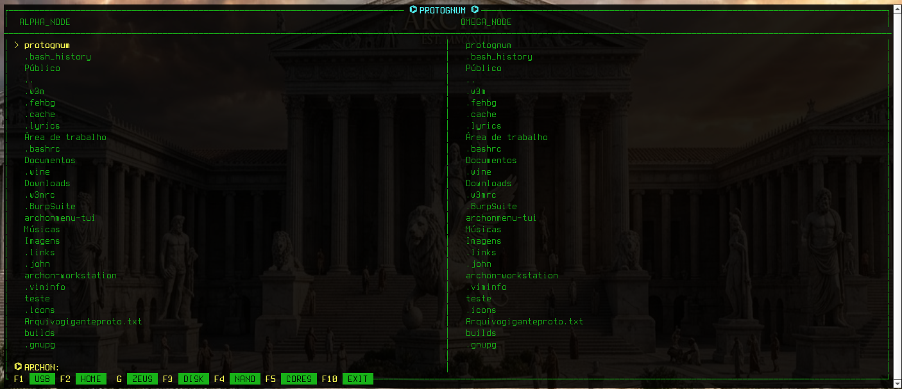
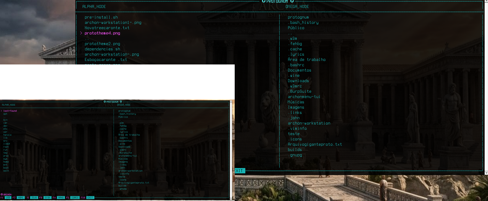

# ⌬ PROTOGNUM ─ [CENTRAL DE COMANDO]
> **Gerenciador Tático Alpha Node** • *Ambiente de Recon e Operações Nucleares*

## 📸 INTERFACE DO SISTEMA




---

## ⌨️ PROTOCOLO DE ATALHOS (CONSOLE)


| Tecla | Módulo | Função de Operação |
| :---: | :--- | :--- |
| **F1** | 💾 **USB** | Montagem segura em `/run/media/` via `udisksctl`. |
| **F2** | 🏠 **HOME** | Salto tático para o diretório `/home/$USER`. |
| **G**  | ⚡ **ZEUS** | **Recon:** Navegação Google Duck / YouTube. |
| **F3** | 💽 **DISK** | `cfdisk` - Gerenciador de partições. **[!] CUIDADO.** |
| **F4** | 📝 **NANO** | Editor de código e logs em tempo real. |
| **F5** | 🧠 **CORES** | Alternar esquemas de cores. |
| **F10**| ❌ **EXIT** | Desativação segura do sistema. |

---

## 📦 DEPENDÊNCIAS
`ncurses`, `networkmanager`, `udisks2`, `polkit`, `qterminal`, `nsxiv`.

### 🛠️ Instalação (Arch / Archon):
```bash
sudo pacman -S ncurses networkmanager udisks2 polkit qterminal nsxiv base-devel
```

---

## 🛰️ MÓDULOS DE VISUALIZAÇÃO


| Editor Nano | Visualização de Assets |
| :---: | :---: |
|  |  |

---
**[⌬] STATUS:** *Sistema Operacional • Zeus-Browser ativo • Aguardando comandos.*

