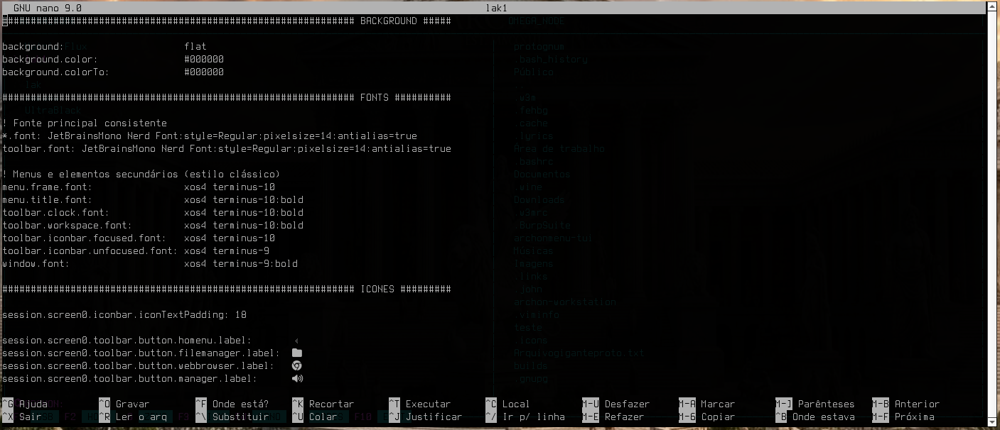
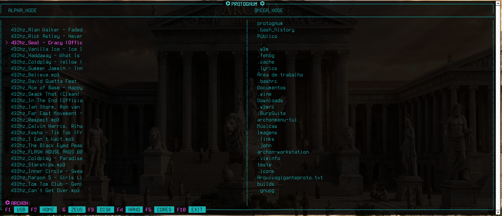

# ⌬ PROTOGNUM ─ [CENTRAL DE COMANDO]
> **Gerenciador Tático Alpha Node** • *Engenharia de Baixo Nível & Operações de Núcleo*

---

## 📸 INTERFACE DO SISTEMA


---

## ⌨ PROTOCOLO DE ATALHOS (CONSOLE)


| Tecla | Módulo | Função de Operação |
| :--- | :--- | :--- |
| **F1** | 💾 **USB** | Montagem segura em `/run/media/` via `udisksctl`. |
| **F2** | 🏠 **HOME** | Salto tático para o diretório `/home/$USER`. |
| **G ❱ G + ENTER + ENTER** | ⚡ **ZEUS** | **Recon:** Abre o console com a primeira tecla e confirma a busca com a sequência. |
| **F3** | 💽 **DISK** | `cfdisk` - Gerenciador de partições. **[!] CUIDADO.** |
| **F4** | 📝 **NANO** | Editor de código e logs em tempo real. |
| **F5** | 🧠 **CORES** | Alternar esquemas de cores. |
| **F10** | ❌ **EXIT** | Desativação segura do sistema. |


## 📦 DEPENDÊNCIAS
`ncurses`, `networkmanager`, `udisks2`, `polkit`, `qterminal`, `nsxiv`, `chromium `.

---

## 🚀 RITUAL DE INSTALAÇÃO

O sistema possui uma forja inteligente que detecta o ambiente e baixa automaticamente o ecossistema de áudio necessário durante o processo.

### 1. Preparar o Terreno (Dependências)
Antes de compilar, garanta as ferramentas essenciais de compilação e as bibliotecas de sistema:

```bash
sudo pacman -S ncurses networkmanager udisks2 polkit qterminal nsxiv base-devel git make gcc
```

### 2. Clonagem da Central
Baixe o código-fonte original diretamente do repositório do Olimpo:

```bash
git clone https://github.com/luiskallak-design/protognum
cd protognum/protognum
```

### 3. Compilação e Instalação Global
Dispare a compilação do núcleo. O sistema verificará a presença do `archonplayer` e o integrará de forma automatizada caso necessário.

```bash
# Compila e prepara os binários locais
make

# Move o binário de forma segura para o caminho do sistema
sudo make install
```

---

## ⚡ OTIMIZAÇÃO PARA HARDWARE LIMITADO / NOTEBOOKS

Se você estiver rodando o Protognum em um notebook antigo ou com hardware mais modesto, o sistema operacional pode exibir um aviso de que o `/bin/bash` travou ao fechar o programa. Isso ocorre devido à lentidão do processador para limpar os processos do shell em segundo plano.

Para economizar memória RAM e forçar um fechamento de janela limpo e instantâneo, inicialize o gerenciador substituindo o processo do terminal através do comando `exec`:

```bash
exec protognum
```

### Inicialização Permanente (Opcional)
Para automatizar esse comportamento e não precisar digitar `exec` manualmente todas as vezes, adicione um alias ao arquivo de configuração do seu shell (`~/.bashrc` ou `~/.zshrc`):

```bash
alias protognum='exec /usr/local/bin/protognum'
```

---

## 🛰️ MÓDULOS DE VISUALIZAÇÃO


| Editor Nano | Visualização de Assets |
| :---: | :---: |
|  |  |

---
**[⌬] STATUS:** *Sistema Operacional • Zeus-Browser ativo • Aguardando comandos.*
<!-- TAGS: archlinux terminal tui c-programming low-level sysadmin hacking aesthetic archon zeus-browser -->

